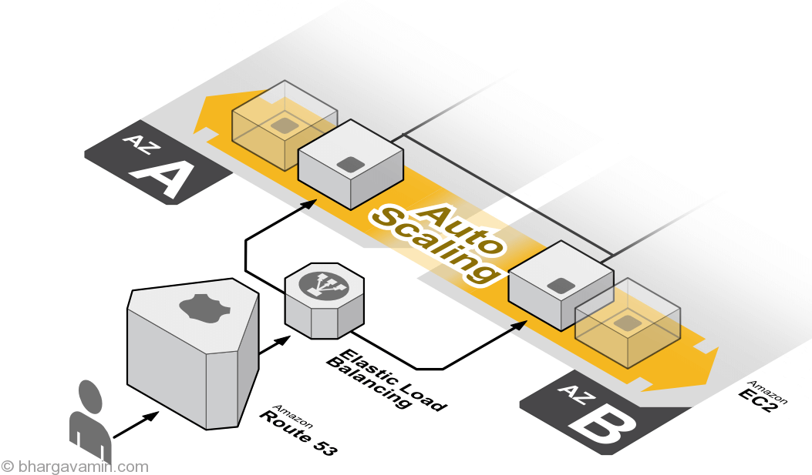

# Intro To AWS

AWS is a cloud service from Amazon, which provides services in the form of building blocks, these building blocks can be used to create and deploy any type of application in the cloud.

### Services offered 

    - Compute
    - Storage
    - Database
    - Migration
    - Network and Content 
    - Delivery
    - Management Tools
    - Security & Identity 
    - Compliance
    - Messaging

 *This workshop will cover Security & Identity, Compute, Storage*

---
 ## Getting setup 
**Creating an IAM user.**

AWS Identity and Access Management (IAM) is a web service that helps you securely control access to AWS resources. You use IAM to control who is authenticated (signed in) and authorized (has permissions) to use resources.

IAM is the rule book of AWS. It controls users and services. Every user and service needs permissions which are defined by IAM.

1. Creating an Admin using the account. (Using the root account as an admin is bad practice)
2. In Console navigate to IAM.
3. Select "Users" then "Add User"
4. Fill out details and enable console and programmatic access. 
5. Press "Next: Permissions"
6. At the top select "Attach existing policies directly" 
7. Under policies select AdministratorAccess 
8. Create the user and save the credentials 

Congratulations we have used our root account to create a new admin user. Take extra notice of all the options we have when attaching policies to our users. IAM allows us to use predefined policies or create policies with very fine details to give the exact amount of access to a user or service. Now go ahead and log in to your new user account.

## AWS EC2 (Compute)

Now using our new admin account let us rent a server from AWS. In AWS this service is called EC2. Amazon Elastic Compute Cloud (Amazon EC2) provides scalable computing capacity in the Amazon Web Services (AWS) Cloud. 

Before we can deploy a server in our cloud environment we first need to define a network to put the server on. There are many configurations we can do but we will do the most basic. A simple public subnet. A network in AWS is called a VPC (Virtual Private Cloud)

### Creating a VPC
1. In the console navigate to VPC
2. Click VPC Wizard. 
3. Select a single public subnet 
4. Name your VPC and subnet
5. Create

AWS will now automatically go out and configure our network...and we're done. Now we can go to EC2 and deploy a server.

### Deploying a Server 

To deploy a server or EC2 we need a few things. First is the VPC to deploy on, an Operating system, the type of hardware we want, and finally the networking.

1. Navigate to EC2
2. Click launch instance
3. Select Ubuntu
4. Select t2.micro for Instance Type
5. click "Next: Instance details". Find the option assign public IP and set that to True.
6. Click "Review and Launch" 
7. Create a new key pair and download
8. Launch instance

Congrats, we just launched our first server but how do we connect? 

Navigate to the "Instances" tab in EC2 and right-click on the instance. In the menu, press connects and navigate to SSH. Here we see a command to use to connect to the instance. Using Putty or Bash we can connect!

### Advanced EC2 Applicaitons 

#### Elastic Load Balencing (Scaling)


## AWS S3 "Bucket" (Storage)

Amazon Simple Storage Service (Amazon S3) is an object storage service that offers industry-leading scalability, data availability, security, and performance. This means customers of all sizes and industries can use it to store and protect any amount of data for a range of use cases, such as data lakes, websites, mobile applications, backup and restore, archive, enterprise applications, IoT devices, and big data analytics

S3 are often called buckets and can store data at scale and additionally can be used for static website hosting or content distribution. In this case, we will deploy a simple static website. 

### Creating a Bucket

1. In the console navigate to S3
2. Click "Create Bucket"
3. Name your bucket. (bucket names must be unique)
4. Unselect "Block all public access"
5. Click Create.

Now we have the bucket created let us upload our website. Using the index.html drag it into the bucket and were done!

#### Configuring the bucket for website hosting 

1. While in the bucket select Properties.
2. Click "Static website hosting"
3. Select "Use this bucket to host a website"
4. Set Index document to our index.html
5. Save.
6. Visit the bucket link above.

Wait why can we not see the website?

Buckets just like users need to have a policy attached to them. We need to tell our bucket that everyone should be able to see the file in the bucket. These policies can be tricky and when you see a "data breach" often this is the area that goes wrong.

### Updating the bucket policy 
1. Click Permissions > Bucket Policy
2. Copy and paste the policy below.

```{
    "Version": "2012-10-17",
    "Statement": [
        {
            "Sid": "AllowPublicReadAccess",
            "Effect": "Allow",
            "Principal": "*", //defines who can call the action
            "Action": "s3:GetObject", // what the action is 
            "Resource": "arn:aws:s3:::YOUR_BUCKET_NAME/*" // where the action can be done
        }
    ]
}
```

**Note: arn:aws:s3:::YOUR_BUCKET_NAME/* could be dangerous**

Now when we visit the link we can see the site!


